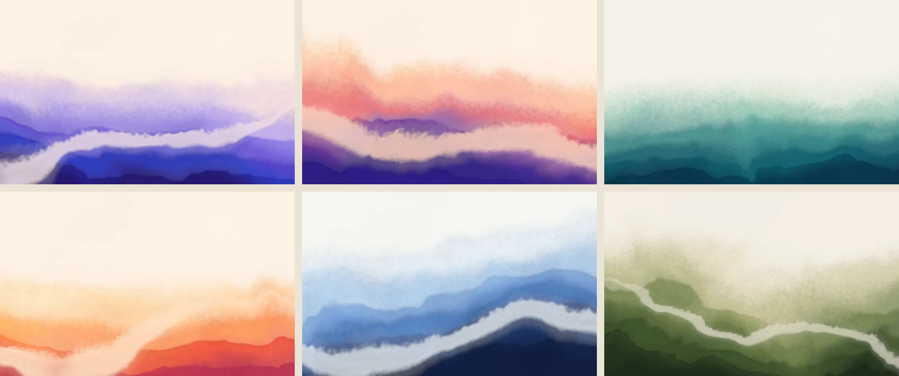

# Pigment Drift

**Watercolor backgrounds for the web: still or moving, tweakable, and ready to drop into your site.**



*Pigment drift* is the slow change in hue you get when ink or watercolor pools, dries and shifts. It's technically a defect, but a lovely one. This generator paints that look on the GPU: layered washes that drift in hue, a lifted current winding through them, mist where the pigment dissolves into paper, granulation, feathered edges and brush relief.


- **Tweak or randomize.** About 20 parameters grouped as Pigment, Composition, Current, Paper & texture and Motion. Lock any group, then hit Randomize (or roll the dice on a single group).
- **Still or moving.** Every piece is a seamless loop. Pause on any moment for a still.
- **Desktop and mobile.** Compositions adapt to any aspect ratio. Switch the preview to a phone (or, on a phone, to a desktop screen) to see both.
- **Easy export, with instructions.** Each export comes as a zip pack containing the files, copy-paste HTML/CSS, an `example.html` and a README.
  - **Still image**: WebP / JPEG / PNG at retina sizes, with desktop and mobile versions.
  - **Video loop**: frame-exact MP4 (H.264) or WebM (VP9), rendered in the browser, desktop and portrait.
  - **Live embed**: a ~10 KB (gzipped) web component that renders the real thing on the visitor's GPU.
  - **Config & link**: a few hundred bytes of JSON, or a share link that reopens the piece.

## Quick start

```bash
npm install
npm run dev
```

Open the printed URL. Keyboard: <kbd>R</kbd> randomize · <kbd>S</kbd> new seed · <kbd>Space</kbd> still/moving · <kbd>H</kbd> hide controls · <kbd>E</kbd> export · <kbd>Ctrl/⌘ Z</kbd> undo. Double-click a slider to reset it.

```bash
npm test          # unit tests (vitest)
npm run typecheck # TypeScript
npm run build     # production build in dist/
```

## Using an export on your site

All three formats use the same pattern: one element as the first thing inside `<body>`, fixed behind your content.

**Live embed**

```html
<pigment-drift class="pd-bg" poster="pigment-drift-poster.webp"
  config='{"v":1,"seed":4127,"paper":"#fdf1e3","colors":["#2a1a7a","#3446c9","#6a4fd6","#b7a2ee","#f3cfdf"], …}'></pigment-drift>
<script src="pigment-drift.min.js" defer></script>

<style>
  .pd-bg { position: fixed; inset: 0; z-index: -1; pointer-events: none; }
</style>
```

| Attribute | Default | What it does |
| --- | --- | --- |
| `config` | — | The piece, as JSON (copy it from the generator). Can also go in a child `<script type="application/json">`. |
| `poster` | — | Image shown until the first frame, and instead of the canvas if WebGL2 isn't available. |
| `still` | off | Render one frame instead of animating. |
| `phase` | `0` | Which moment of the loop to show when still (0–1). |
| `fps` | `30` | Frame-rate cap while animating. |
| `quality` | `0.75` | Render scale while animating (0.25–1). Stills always render at full resolution. |
| `max-dpr` | `1.5` | Caps device pixel ratio. |

The runtime pauses when the element is off-screen or the tab is hidden, draws a single still for visitors who prefer reduced motion, keeps animation inside a pixel budget, and recovers from WebGL context loss.

To mount it yourself instead: `const bg = PigmentDrift.mount(element, config, { fps: 30 })`, then `bg.update(newConfig)` or `bg.destroy()`.

**Image or video**: the packs include ready-made HTML and CSS, including `<source media>` switching for portrait screens and a reduced-motion fallback for video.

## How it works

Everything is one fragment shader ([`src/engine/shader.ts`](src/engine/shader.ts)):

1. **Domain-warped noise** gives the wet-in-wet swirl. Warp strengths are kept below the point where space folds, since folds show up as hard creases.
2. **A turbulent height field** (0 at the anchored edge, 1 at the horizon) is cut into **washes** painted back to front. Far washes are pale and soft, near ones deep and dense, with darker pooled rims.
3. **Hue drift**: the colour index follows the height field plus a slow noise field, mixed in OKLab across a five-pigment ramp.
4. **The current**: a meandering centreline with perspective (narrower towards the horizon), where pigment is lifted, with flowing streaks.
5. **Paper**: mist, granulation, mottling, brush relief (lit via screen-space derivatives) and grain. Grain is sized in CSS pixels, so it looks the same on every screen and export size.

**Seamless loops**: every time-varying input is driven by a point travelling once around a circle per loop, and the current's streaks use two cross-faded phases. Frame *N* is exactly frame 0, so video exports are frame-exact and loop without a seam.

```
src/
  engine/     params schema, palettes, color math, shader, WebGL2 renderer (shared by everything)
  app/        the generator UI: store + history, stage, control panel, export dialog
  export/     tiled offscreen rendering, video encoding (mediabunny/WebCodecs), zip packs, snippets
  embed/      the <pigment-drift> runtime → public/embed/pigment-drift.min.js
tests/        vitest unit tests
```

Every control, the randomizer, share links, exports and the embed all read one parameter schema ([`src/engine/params.ts`](src/engine/params.ts)), so adding a parameter there wires it up everywhere.

## Deploy (Docker / Dokploy)

The app is fully static: rendering happens in the visitor's browser. The included `Dockerfile` builds it and serves it with nginx (gzip, immutable caching for hashed assets, CORS on `/embed/` so the runtime can be hot-linked, `/healthz` for health checks).

```bash
docker build -t pigment-drift .
docker run -p 8080:80 pigment-drift
```

**On Dokploy:**

1. *Create Project → Create Service → Application.*
2. *Provider:* GitHub → this repository, branch `main`.
3. *Build Type:* **Dockerfile** (path `./Dockerfile`).
4. *Domains:* add your domain with container **port 80** and enable HTTPS.
5. *Deploy.* Optionally turn on auto-deploy so pushes to `main` redeploy.

Once deployed, the generator's *Live embed* tab can point snippets at `https://your-domain/embed/pigment-drift.min.js`.

## Browser support

The generator and the live embed need WebGL2: current Chrome, Edge, Firefox and Safari 15+. Video export uses WebCodecs: current Chrome, Edge, Safari 16.4+ and Firefox 130+. Exported images and videos work everywhere.

## Contributing

Issues and pull requests are welcome. Please run `npm run typecheck && npm test` before opening a PR. For changes to the look, include before/after renders of a few presets.

## License

[MIT](LICENSE). The artwork you generate is yours to use however you like.
