<div align="center">

<a href="https://pigmentdrift.ossianravn.dev">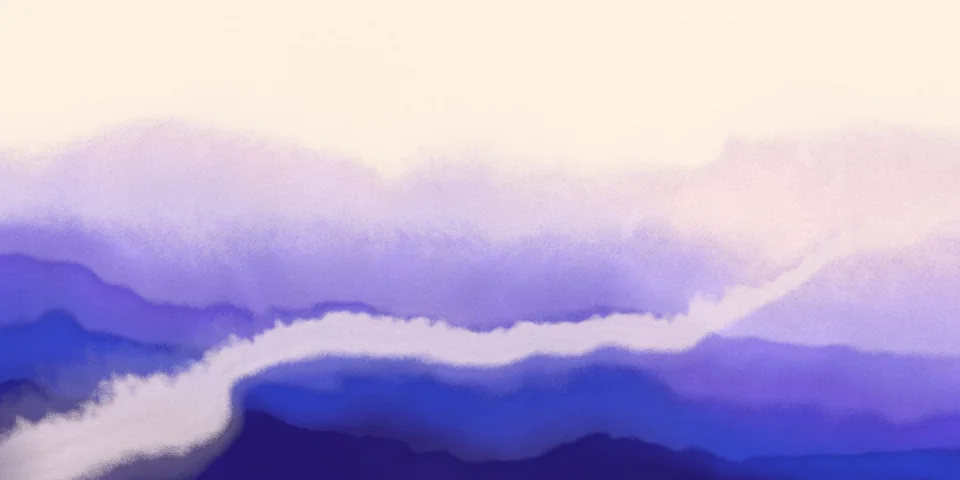</a>

<h1>Pigment Drift</h1>

<p><strong>Watercolor backgrounds for the web.</strong><br>
Still or moving, endlessly tweakable, and ready to drop into your site.</p>

<p>
<a href="https://pigmentdrift.ossianravn.dev"></a>
<a href="https://github.com/ossianravn/pigment-drift-generator/actions/workflows/ci.yml"></a>
<a href="LICENSE"></a>


</p>

<p>
<a href="https://pigmentdrift.ossianravn.dev"><strong>Open the generator</strong></a> &nbsp;·&nbsp;
<a href="https://pigmentdrift.ossianravn.dev/paint/"><strong>Paint with your fingers</strong></a> &nbsp;·&nbsp;
<a href="#presets">Presets</a> &nbsp;·&nbsp;
<a href="#use-it-on-your-site">Use it on your site</a> &nbsp;·&nbsp;
<a href="#how-it-works">How it works</a> &nbsp;·&nbsp;
<a href="#self-host">Self-host</a>
</p>

</div>

<br>

## What is pigment drift?

*Pigment drift* is the slow, unintended shift in an ink's shade or hue as it pools, dries and settles. It's technically a defect, but one that became a style.

The idea comes from [David East's Twitter post](https://x.com/_davideast/status/2106194893810852153), which shared *pigment drift* as a term for generating backgrounds. This project turns that look into a procedural generator you can tweak, animate and export. Everything is painted live on the GPU: layered washes that drift in hue, a pale current winding through them, mist where pigment dissolves into paper, granulation, feathered edges and brush relief.

## Presets

<table>
  <tr>
    <td align="center" width="25%"><a href="https://pigmentdrift.ossianravn.dev/#c=eyJ2IjoxLCJzZWVkIjo0MTI3LCJwYXBlciI6IiNmZGYxZTMiLCJjb2xvcnMiOlsiIzJhMWE3YSIsIiMzNDQ2YzkiLCIjNmE0ZmQ2IiwiI2I3YTJlZSIsIiNmM2NmZGYiXSwiZGVuc2l0eSI6MC45NSwiaHVlRHJpZnQiOjAuNSwiYW5jaG9yIjoiYm90dG9tIiwiY292ZXJhZ2UiOjAuNTUsImxheWVycyI6NSwicmlkZ2UiOjAuNiwic2NhbGUiOjEsIndhcnAiOjAuNzUsIm1pc3QiOjAuNiwicml2ZXIiOjAuODUsInJpdmVyV2lkdGgiOjAuMDksInJpdmVyTWVhbmRlciI6MC42LCJyaXZlckRlcHRoIjowLjUsInJpdmVyVGlsdCI6MC4zNSwiZ3JhbnVsYXRpb24iOjAuNTUsImdyYWluIjowLjQ1LCJlZGdlIjowLjUsImZlYXRoZXIiOjAuNiwiYnJ1c2giOjAuNDUsIm1vdGlvbiI6MC40NSwiZmxvdyI6MC40NSwibG9vcCI6MTZ9">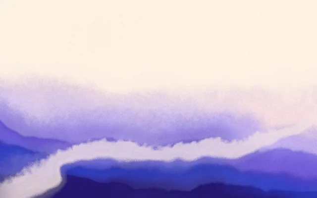</a><br><sub><b>Soft Current</b></sub></td>
    <td align="center" width="25%"><a href="https://pigmentdrift.ossianravn.dev/#c=eyJ2IjoxLCJzZWVkIjo5MDIxMSwicGFwZXIiOiIjZmRmMWUzIiwiY29sb3JzIjpbIiMzMzIyOGYiLCIjOGEzYWE4IiwiI2VmNGY2MyIsIiNmZjhhM2QiLCIjZmZjNzdhIl0sImRlbnNpdHkiOjAuOTUsImh1ZURyaWZ0IjowLjc1LCJhbmNob3IiOiJib3R0b20iLCJjb3ZlcmFnZSI6MC42LCJsYXllcnMiOjUsInJpZGdlIjowLjQ1LCJzY2FsZSI6MSwid2FycCI6MC45LCJtaXN0IjowLjYsInJpdmVyIjowLjgsInJpdmVyV2lkdGgiOjAuMTMsInJpdmVyTWVhbmRlciI6MC4zNSwicml2ZXJEZXB0aCI6MC40NSwicml2ZXJUaWx0IjotMC4yNSwiZ3JhbnVsYXRpb24iOjAuNTUsImdyYWluIjowLjQ1LCJlZGdlIjowLjUsImZlYXRoZXIiOjAuNiwiYnJ1c2giOjAuNDUsIm1vdGlvbiI6MC40NSwiZmxvdyI6MC40NSwibG9vcCI6MTZ9">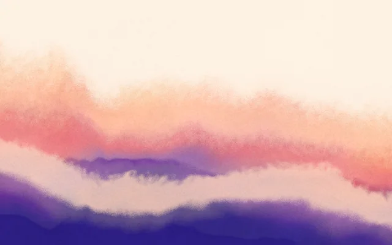</a><br><sub><b>Ember Field</b></sub></td>
    <td align="center" width="25%"><a href="https://pigmentdrift.ossianravn.dev/#c=eyJ2IjoxLCJzZWVkIjozMTMzNywicGFwZXIiOiIjZmRmMWUzIiwiY29sb3JzIjpbIiNjNDNhNWEiLCIjZjA1YTNhIiwiI2ZmOGYyZSIsIiNmZmI1NGEiLCIjZmZlMGE2Il0sImRlbnNpdHkiOjAuOTUsImh1ZURyaWZ0IjowLjYsImFuY2hvciI6ImJvdHRvbSIsImNvdmVyYWdlIjowLjUsImxheWVycyI6NCwicmlkZ2UiOjAuNSwic2NhbGUiOjEsIndhcnAiOjAuNiwibWlzdCI6MC42LCJyaXZlciI6MC45LCJyaXZlcldpZHRoIjowLjExLCJyaXZlck1lYW5kZXIiOjAuNzUsInJpdmVyRGVwdGgiOjAuNTUsInJpdmVyVGlsdCI6MC40NSwiZ3JhbnVsYXRpb24iOjAuNTUsImdyYWluIjowLjQ1LCJlZGdlIjowLjQsImZlYXRoZXIiOjAuNiwiYnJ1c2giOjAuNDUsIm1vdGlvbiI6MC40NSwiZmxvdyI6MC40NSwibG9vcCI6MTZ9">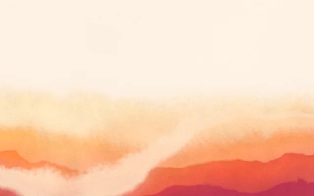</a><br><sub><b>Apricot Path</b></sub></td>
    <td align="center" width="25%"><a href="https://pigmentdrift.ossianravn.dev/#c=eyJ2IjoxLCJzZWVkIjoyNzE4LCJwYXBlciI6IiNmNWYyZWEiLCJjb2xvcnMiOlsiIzBiM2Y1NyIsIiMxNDcwN2YiLCIjM2Y5Yzk4IiwiIzkzY2RiOSIsIiNlMmVmZDYiXSwiZGVuc2l0eSI6MC45NSwiaHVlRHJpZnQiOjAuNSwiYW5jaG9yIjoiYm90dG9tIiwiY292ZXJhZ2UiOjAuNDgsImxheWVycyI6NiwicmlkZ2UiOjAuNywic2NhbGUiOjEsIndhcnAiOjAuNTUsIm1pc3QiOjAuNzUsInJpdmVyIjowLCJyaXZlcldpZHRoIjowLjA5LCJyaXZlck1lYW5kZXIiOjAuNiwicml2ZXJEZXB0aCI6MC41LCJyaXZlclRpbHQiOjAuMzUsImdyYW51bGF0aW9uIjowLjcsImdyYWluIjowLjQ1LCJlZGdlIjowLjUsImZlYXRoZXIiOjAuNiwiYnJ1c2giOjAuNDUsIm1vdGlvbiI6MC40NSwiZmxvdyI6MC40NSwibG9vcCI6MTZ9">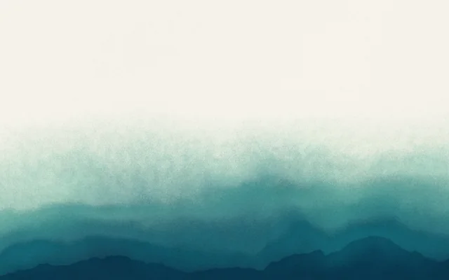</a><br><sub><b>Sea Glass</b></sub></td>
  </tr>
  <tr>
    <td align="center" width="25%"><a href="https://pigmentdrift.ossianravn.dev/#c=eyJ2IjoxLCJzZWVkIjo2MDIyLCJwYXBlciI6IiNmNGVmZTQiLCJjb2xvcnMiOlsiIzI0MzMxZiIsIiM0NzVmMzMiLCIjN2Y4ZjRmIiwiI2M0YmY4NiIsIiNlYmRmYzQiXSwiZGVuc2l0eSI6MC45NSwiaHVlRHJpZnQiOjAuNSwiYW5jaG9yIjoiYm90dG9tIiwiY292ZXJhZ2UiOjAuNjIsImxheWVycyI6NiwicmlkZ2UiOjAuODUsInNjYWxlIjowLjg1LCJ3YXJwIjowLjc1LCJtaXN0IjowLjksInJpdmVyIjowLjYsInJpdmVyV2lkdGgiOjAuMDYsInJpdmVyTWVhbmRlciI6MC44NSwicml2ZXJEZXB0aCI6MC41LCJyaXZlclRpbHQiOi0wLjQsImdyYW51bGF0aW9uIjowLjU1LCJncmFpbiI6MC40NSwiZWRnZSI6MC41LCJmZWF0aGVyIjowLjYsImJydXNoIjowLjYsIm1vdGlvbiI6MC40NSwiZmxvdyI6MC40NSwibG9vcCI6MTZ9">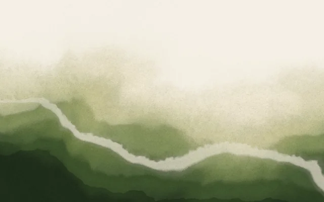</a><br><sub><b>Moss &amp; Fog</b></sub></td>
    <td align="center" width="25%"><a href="https://pigmentdrift.ossianravn.dev/#c=eyJ2IjoxLCJzZWVkIjoxNjE4LCJwYXBlciI6IiNmZmY0ZWUiLCJjb2xvcnMiOlsiIzVjMjE1MCIsIiNhMzQwNmYiLCIjZGI2ZjkzIiwiI2YyYWRiZiIsIiNmYmUwZDUiXSwiZGVuc2l0eSI6MC45NSwiaHVlRHJpZnQiOjAuMzUsImFuY2hvciI6InRvcCIsImNvdmVyYWdlIjowLjU4LCJsYXllcnMiOjQsInJpZGdlIjowLjQsInNjYWxlIjoxLCJ3YXJwIjoxLjEsIm1pc3QiOjAuNywicml2ZXIiOjAsInJpdmVyV2lkdGgiOjAuMDksInJpdmVyTWVhbmRlciI6MC42LCJyaXZlckRlcHRoIjowLjUsInJpdmVyVGlsdCI6MC4zNSwiZ3JhbnVsYXRpb24iOjAuNTUsImdyYWluIjowLjQ1LCJlZGdlIjowLjUsImZlYXRoZXIiOjAuODUsImJydXNoIjowLjQ1LCJtb3Rpb24iOjAuNDUsImZsb3ciOjAuNDUsImxvb3AiOjE2fQ">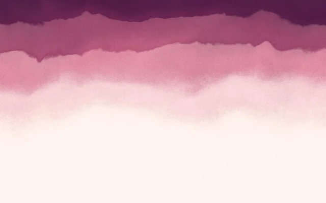</a><br><sub><b>Rose Quartz</b></sub></td>
    <td align="center" width="25%"><a href="https://pigmentdrift.ossianravn.dev/#c=eyJ2IjoxLCJzZWVkIjo0NjY5LCJwYXBlciI6IiNmNmY2ZjIiLCJjb2xvcnMiOlsiIzE0MjQ0YSIsIiMyODUzOGYiLCIjNWY5M2NmIiwiI2E5Y2RlYyIsIiNlNWVmZjYiXSwiZGVuc2l0eSI6MC45NSwiaHVlRHJpZnQiOjAuNSwiYW5jaG9yIjoiYm90dG9tIiwiY292ZXJhZ2UiOjAuNywibGF5ZXJzIjo3LCJyaWRnZSI6MC45LCJzY2FsZSI6MS4yNSwid2FycCI6MC40NSwibWlzdCI6MC42LCJyaXZlciI6MC43NSwicml2ZXJXaWR0aCI6MC4wNywicml2ZXJNZWFuZGVyIjowLjYsInJpdmVyRGVwdGgiOjAuMywicml2ZXJUaWx0IjowLjEsImdyYW51bGF0aW9uIjowLjY1LCJncmFpbiI6MC40NSwiZWRnZSI6MC42NSwiZmVhdGhlciI6MC42LCJicnVzaCI6MC40NSwibW90aW9uIjowLjQ1LCJmbG93IjowLjQ1LCJsb29wIjoxNn0">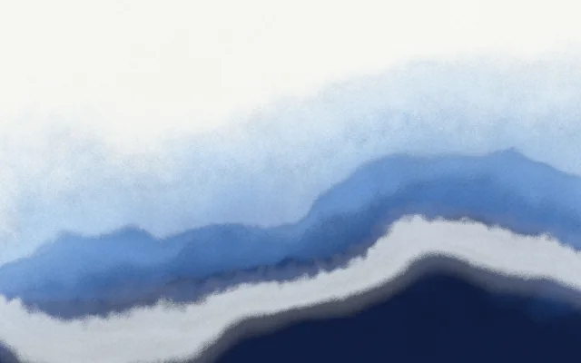</a><br><sub><b>Glacier</b></sub></td>
    <td align="center" width="25%"><a href="https://pigmentdrift.ossianravn.dev/#c=eyJ2IjoxLCJzZWVkIjo3Nzc3LCJwYXBlciI6IiMxMjEwMjAiLCJjb2xvcnMiOlsiI2ZmN2E4YSIsIiNiMjViZDYiLCIjNWI1ZmUwIiwiIzJjM2Y4ZiIsIiMxYzFhM2EiXSwiZGVuc2l0eSI6MC45LCJodWVEcmlmdCI6MC41LCJhbmNob3IiOiJib3R0b20iLCJjb3ZlcmFnZSI6MC41OCwibGF5ZXJzIjo1LCJyaWRnZSI6MC41NSwic2NhbGUiOjEsIndhcnAiOjAuOTUsIm1pc3QiOjAuNSwicml2ZXIiOjAuNywicml2ZXJXaWR0aCI6MC4wOCwicml2ZXJNZWFuZGVyIjowLjYsInJpdmVyRGVwdGgiOjAuNSwicml2ZXJUaWx0IjowLjM1LCJncmFudWxhdGlvbiI6MC41NSwiZ3JhaW4iOjAuMzUsImVkZ2UiOjAuMzUsImZlYXRoZXIiOjAuNiwiYnJ1c2giOjAuNDUsIm1vdGlvbiI6MC40NSwiZmxvdyI6MC40NSwibG9vcCI6MTZ9">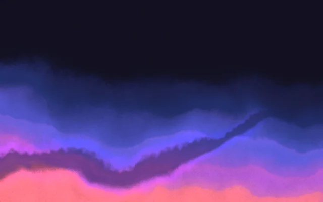</a><br><sub><b>Night Ink</b></sub></td>
  </tr>
  <tr>
    <td align="center" width="25%"><a href="https://pigmentdrift.ossianravn.dev/#c=eyJ2IjoxLCJzZWVkIjoxODMxLCJwYXBlciI6IiNmNmVmZGYiLCJjb2xvcnMiOlsiIzBmMmE0YSIsIiMxZDRmN2MiLCIjM2Y3ZmE4IiwiIzljYzNkNSIsIiNlY2UzY2MiXSwiZGVuc2l0eSI6MC45NSwiaHVlRHJpZnQiOjAuNDUsImFuY2hvciI6ImJvdHRvbSIsImNvdmVyYWdlIjowLjcyLCJsYXllcnMiOjYsInJpZGdlIjowLjksInNjYWxlIjowLjgsIndhcnAiOjEuMzUsIm1pc3QiOjAuNCwicml2ZXIiOjAsInJpdmVyV2lkdGgiOjAuMDksInJpdmVyTWVhbmRlciI6MC42LCJyaXZlckRlcHRoIjowLjUsInJpdmVyVGlsdCI6MC4zNSwiZ3JhbnVsYXRpb24iOjAuNywiZ3JhaW4iOjAuNDUsImVkZ2UiOjAuNjUsImZlYXRoZXIiOjAuNywiYnJ1c2giOjAuNiwibW90aW9uIjowLjQ1LCJmbG93IjowLjQ1LCJsb29wIjoxNiwib3BhY2l0eSI6MX0">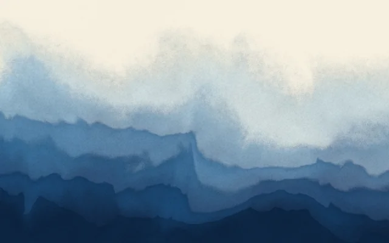</a><br><sub><b>Great Wave</b></sub></td>
    <td align="center" width="25%"><a href="https://pigmentdrift.ossianravn.dev/#c=eyJ2IjoxLCJzZWVkIjoxOTU4LCJwYXBlciI6IiNmM2U2ZDgiLCJjb2xvcnMiOlsiIzNkMGYxNiIsIiM3YTFhMjAiLCIjYjgzMjJhIiwiI2UwN2I0NSIsIiNmMmM4YTIiXSwiZGVuc2l0eSI6MS4wNSwiaHVlRHJpZnQiOjAuNCwiYW5jaG9yIjoiYm90dG9tIiwiY292ZXJhZ2UiOjEuMDUsImxheWVycyI6MywicmlkZ2UiOjAuMjUsInNjYWxlIjoxLjcsIndhcnAiOjAuNSwibWlzdCI6MC4zLCJyaXZlciI6MCwicml2ZXJXaWR0aCI6MC4wOSwicml2ZXJNZWFuZGVyIjowLjYsInJpdmVyRGVwdGgiOjAuNSwicml2ZXJUaWx0IjowLjM1LCJncmFudWxhdGlvbiI6MC41LCJncmFpbiI6MC40NSwiZWRnZSI6MC43NSwiZmVhdGhlciI6MC45LCJicnVzaCI6MC43NSwibW90aW9uIjowLjQ1LCJmbG93IjowLjQ1LCJsb29wIjoxNiwib3BhY2l0eSI6MX0">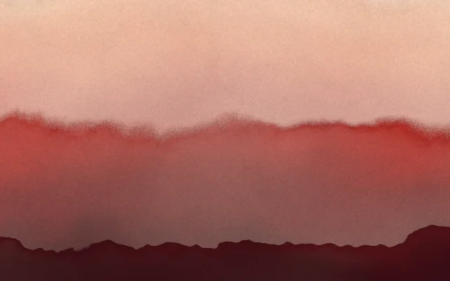</a><br><sub><b>Color Field</b></sub></td>
    <td align="center" width="25%"><a href="https://pigmentdrift.ossianravn.dev/#c=eyJ2IjoxLCJzZWVkIjo2NjAwLCJwYXBlciI6IiMwYzEzMWUiLCJjb2xvcnMiOlsiI2I4ZjVjZiIsIiM0Y2QzYTciLCIjMmU4ZmIzIiwiIzM4M2Y4ZiIsIiMxNTFjMzIiXSwiZGVuc2l0eSI6MC43MiwiaHVlRHJpZnQiOjAuNzUsImFuY2hvciI6InRvcCIsImNvdmVyYWdlIjowLjUyLCJsYXllcnMiOjYsInJpZGdlIjowLjg1LCJzY2FsZSI6MC45LCJ3YXJwIjoxLjQsIm1pc3QiOjAuOTUsInJpdmVyIjowLCJyaXZlcldpZHRoIjowLjA5LCJyaXZlck1lYW5kZXIiOjAuNiwicml2ZXJEZXB0aCI6MC41LCJyaXZlclRpbHQiOjAuMzUsImdyYW51bGF0aW9uIjowLjU1LCJncmFpbiI6MC4zLCJlZGdlIjowLjQ1LCJmZWF0aGVyIjowLjksImJydXNoIjowLjQ1LCJtb3Rpb24iOjAuNjUsImZsb3ciOjAuNDUsImxvb3AiOjE2LCJvcGFjaXR5IjoxfQ">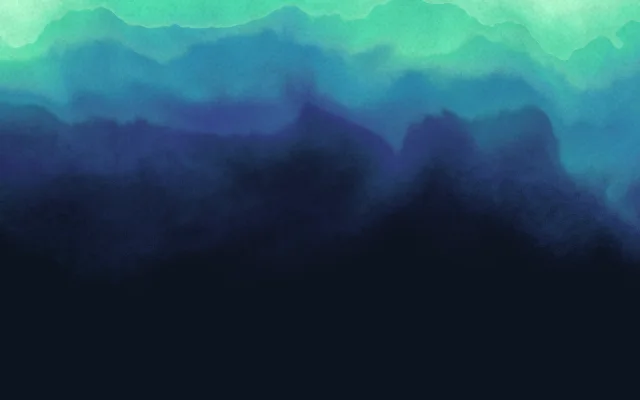</a><br><sub><b>Aurora</b></sub></td>
    <td align="center" width="25%"><a href="https://pigmentdrift.ossianravn.dev/#c=eyJ2IjoxLCJzZWVkIjo0MjQyLCJwYXBlciI6IiNmOWY0ZWMiLCJjb2xvcnMiOlsiIzNhMmQ2YyIsIiM2ZjVkYjUiLCIjYWI5YmQ4IiwiI2U1Y2Q4ZSIsIiNmNmVjZDMiXSwiZGVuc2l0eSI6MC45NSwiaHVlRHJpZnQiOjAuNTUsImFuY2hvciI6ImJvdHRvbSIsImNvdmVyYWdlIjowLjYyLCJsYXllcnMiOjcsInJpZGdlIjowLjksInNjYWxlIjoxLjMsIndhcnAiOjAuNCwibWlzdCI6MC42LCJyaXZlciI6MC43LCJyaXZlcldpZHRoIjowLjA1LCJyaXZlck1lYW5kZXIiOjAuOSwicml2ZXJEZXB0aCI6MC4zNSwicml2ZXJUaWx0IjowLjIsImdyYW51bGF0aW9uIjowLjU1LCJncmFpbiI6MC40NSwiZWRnZSI6MC41LCJmZWF0aGVyIjowLjYsImJydXNoIjowLjQ1LCJtb3Rpb24iOjAuNDUsImZsb3ciOjAuNDUsImxvb3AiOjE2LCJvcGFjaXR5IjoxfQ">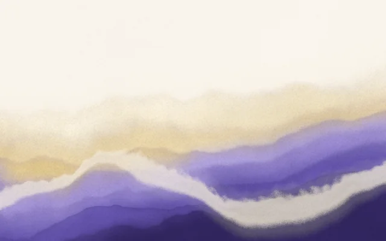</a><br><sub><b>Lavender Hills</b></sub></td>
  </tr>
</table>

<p align="center"><sub>12 of the 26 presets (on 32 palettes). Click any piece to open it in the generator, or press <kbd>R</kbd> there for endless new ones.</sub></p>

## Features

<p align="center">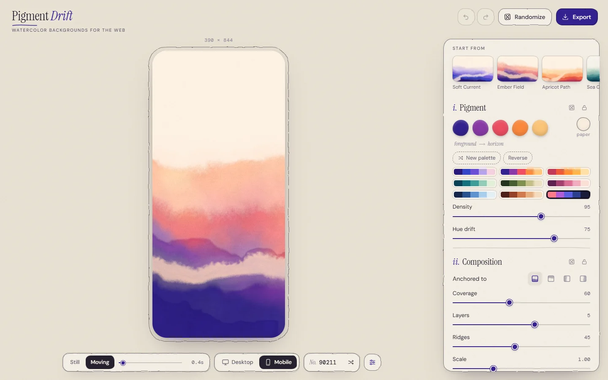</p>

- **Tweak or randomize.** About 20 parameters across *Pigment, Composition, Current, Paper & texture* and *Motion*. Lock the groups you like, then randomize the rest, or roll the dice on a single group.
- **Still or moving.** Every piece is a seamless loop. Pause on any moment to export it as a still.
- **Desktop and mobile.** Compositions adapt to any aspect ratio. Flip the preview to a phone (or, on a phone, to a desktop screen) to check both.
- **You always see what you're changing.** Dragging a slider turns the panel to glass, so only that slider stays on screen. On phones the controls are a short card showing one control at a time: swipe sideways to step through them, or pick one from the rail of chips. Hold the eye button to peek at the whole piece.
- **Screensaver view.** Fullscreen and artwork-only; the controls come back only while you move the mouse.
- **Share links and undo.** The URL always holds the current piece; undo and redo cover every change.

### Export, with instructions

| Export | What you get | Good for |
| --- | --- | --- |
| **Still image** | WebP, JPEG or PNG at retina sizes, desktop and mobile | The lightest page, no script |
| **Video loop** | Frame-exact MP4 (H.264) or WebM (VP9), desktop and portrait | Motion without JavaScript |
| **Live embed** | A `<pigment-drift>` web component, about 10 KB gzipped | Crisp at any size, truly generative |
| **Config & link** | A few hundred bytes of JSON, or a share link | Saving, versioning and sharing pieces |

Each export downloads as a zip pack with the files, copy-paste HTML/CSS, an `example.html` and a README. Videos are rendered in your browser, frame by frame, so the last frame flows straight into the first.

## Paint with your fingers

<p align="center"><a href="https://pigmentdrift.ossianravn.dev/paint/">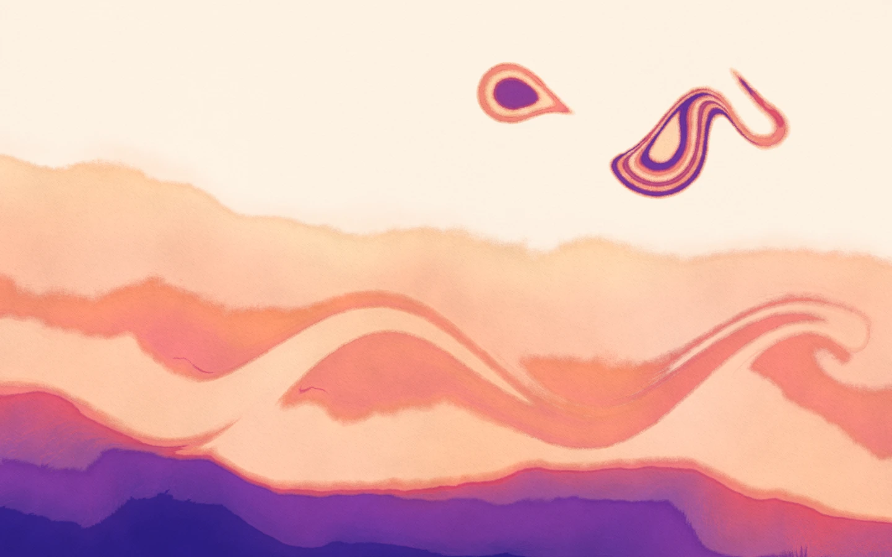</a></p>

**[The paint studio](https://pigmentdrift.ossianravn.dev/paint/)** is a quieter, separate place to make pigment drift by hand, with a mouse, a pen or your fingers. There are no parameters to tune: pick a pigment and touch the paper.

| Gesture | What happens |
| --- | --- |
| **Tap** | A drop of pigment blooms and pushes the washes around it outward. Tap the same spot with other pigments for suminagashi-style rings. |
| **Hold** | The drop keeps growing for as long as you hold. |
| **Drag** | A brush stroke. Wet edges bleed, then dry into the same stacked washes, darker rims and granulation as the generator. |
| **Water** | Stir and comb the floating pigment into marbled folds, or tap to drop clear water. |
| **Blot** | Lifts pigment back off the paper. |

Several fingers work at once, and pens report pressure. While you paint, the tools fade back so nothing sits between you and the paper.

- **Start from a piece.** *Paint* in the generator opens the studio with the piece you were looking at, so you can put your fingers into the pattern itself.
- **Palette & paper.** Switch palettes at any time and the whole painting recolors. Set how many washes it dries into, how far wet pigment bleeds, how much the dried painting breathes, the edges and the paper texture.
- **Nothing to lose.** Undo covers every gesture, and the painting stays in your browser between visits. **Save** downloads a PNG, or opens the share sheet on a phone.

## Use it on your site

Every format follows the same pattern: one element as the first thing inside `<body>`, fixed behind your content. Copy it from **Export** in the generator, or write it by hand:

```html
<pigment-drift class="pd-bg" poster="pigment-drift-poster.webp"
  config='{"v":1,"seed":4127,"paper":"#fdf1e3","colors":["#2a1a7a","#3446c9","#6a4fd6","#b7a2ee","#f3cfdf"], …}'></pigment-drift>
<script src="pigment-drift.min.js" defer></script>

<style>
  .pd-bg { position: fixed; inset: 0; z-index: -1; pointer-events: none; }
</style>
```

Behind a single section instead? Use `position: absolute`, and give the section `position: relative; isolation: isolate;`.

**Where the script comes from.** Self-host `pigment-drift.min.js` (it's in every embed pack), or load it from [jsDelivr](https://www.jsdelivr.com/), a free public CDN that serves it straight from this repository:

```html
<script src="https://cdn.jsdelivr.net/gh/ossianravn/pigment-drift-generator@embed-v1.0.0/embed/pigment-drift.min.js"
  integrity="sha384-…" crossorigin="anonymous" defer></script>
```

CDN URLs are pinned to a version tag and never change underneath your site. The generator's *Live embed* tab writes this tag for you, with the exact integrity hash.

The runtime pauses when the element is off-screen or the tab is hidden, and draws a single still for visitors who prefer reduced motion. It keeps animation within a pixel budget, recovers from WebGL context loss, and falls back to the poster image without WebGL2.

<details>
<summary><b>Element attributes</b></summary>
<br>

| Attribute | Default | What it does |
| --- | --- | --- |
| `config` | — | The piece, as JSON. It can also go in a child `<script type="application/json">`. |
| `poster` | — | Image shown until the first frame, and instead of the canvas if WebGL2 isn't available. |
| `still` | off | Render one frame instead of animating. |
| `phase` | `0` | Which moment of the loop to show when still (0–1). |
| `fps` | `30` | Frame-rate cap while animating. |
| `quality` | `0.75` | Render scale while animating (0.25–1). Stills always render at full resolution. |
| `max-dpr` | `1.5` | Caps the device pixel ratio. |

</details>

<details>
<summary><b>JavaScript API</b></summary>
<br>

```js
const bg = PigmentDrift.mount(document.querySelector('.hero'), config, { fps: 30, still: false });
bg.update(newConfig);   // swap pieces without a reload
bg.destroy();
```

</details>

<details>
<summary><b>Image and video packs</b></summary>
<br>

The packs include ready-made HTML and CSS: `background-image` with a portrait version for phones, or a muted, looping, inline `<video>` that switches to a portrait file with `<source media>` and shows the still to visitors who prefer reduced motion.

</details>

## Keyboard and links

| Key | Action |
| --- | --- |
| <kbd>R</kbd> | Randomize |
| <kbd>S</kbd> | New seed, same settings |
| <kbd>Space</kbd> | Still / moving |
| <kbd>F</kbd> | Screensaver |
| <kbd>H</kbd> | Hide controls |
| <kbd>E</kbd> | Export |
| <kbd>P</kbd> | Paint this piece in the studio |
| <kbd>Ctrl/⌘ Z</kbd> | Undo (add <kbd>Shift</kbd> to redo) |

Double-click any slider to reset it.

In the paint studio:

| Key | Action |
| --- | --- |
| <kbd>1</kbd>–<kbd>5</kbd> | Pigments, deepest to palest |
| <kbd>W</kbd> / <kbd>B</kbd> | Water / blot |
| <kbd>[</kbd> <kbd>]</kbd> | Brush size (or the mouse wheel) |
| <kbd>P</kbd> | Palette & paper |
| <kbd>H</kbd> | Hide everything but the painting |
| <kbd>Ctrl/⌘ S</kbd> | Save as PNG |
| <kbd>Ctrl/⌘ Z</kbd> | Undo (add <kbd>Shift</kbd> to redo) |

| Link | Opens |
| --- | --- |
| `#c=…` | A specific piece (every share link looks like this) |
| `?view=mobile` | The phone preview |
| `?screensaver` | The artwork-only view, for kiosks and second screens |
| `?open=export:video` | The exporter on a tab: `image`, `video`, `embed` or `config` |
| `/paint/` | The paint studio (`?open=paper` opens its palette sheet, `?blank` starts on bare paper) |

## How it works

Every pixel comes from one fragment shader ([`src/engine/shader.ts`](src/engine/shader.ts)), so the same code renders the editor preview, 4K stills, video frames and the embed.

1. **Domain-warped noise** gives the wet-in-wet swirl. Warp strengths stay below the point where space folds, since folds show up as hard creases.
2. **A turbulent height field**, from the anchored edge to the horizon, is cut into **washes** painted back to front: pale and soft near the horizon, deep and dense up front, with darker pooled rims.
3. **Hue drift**: each pixel's colour follows that height plus a slow noise field, mixed in OKLab across a five-pigment ramp.
4. **The current** is a meandering path with perspective, where pigment is lifted away and streaks flow along it.
5. **Paper**: mist, granulation, mottling, brush relief lit via screen-space derivatives, and grain sized in CSS pixels, so it looks the same on every screen and export size.

**Seamless loops**: every time-varying input is driven by a point travelling once around a circle per loop, and the current's streaks cross-fade between two phases. Frame *N* is exactly frame 0.

**The paint studio** ([`src/paint/`](src/paint/)) keeps a *pigment field* on the GPU: how much pigment lies on each spot of paper, and how wet it is.

- A small stable-fluids simulation moves the field: advection, vorticity confinement and a pressure solve. Resampling is sharpened Catmull-Rom, so folds stay crisp.
- Drops use the area-preserving map from mathematical marbling, which squeezes everything around them into rings.
- Wet pigment creeps outward along the paper fibers while its core keeps its colour.
- The render pass cuts the field into washes with the generator's stack, colour ramp and paper, so whatever you paint dries into the same style. *Paint this* in the generator converts the piece's height field into pigment.

<details>
<summary><b>Project structure</b></summary>
<br>

```
src/
  engine/   parameter schema, palettes, color math, the shader, WebGL2 renderer
  app/      the generator UI: store + history, stage, control panel, screensaver, export dialog
  export/   tiled offscreen rendering, video encoding (WebCodecs via mediabunny), zip packs, snippets
  embed/    the <pigment-drift> runtime source
  paint/    the paint studio: pigment field, fluid sim, brushes, its own UI
paint/      the studio's page, served at /paint/
embed/      the built runtime (committed; jsDelivr serves it from version tags)
tests/      vitest unit tests
```

Every control, the randomizer, share links, exports and the embed read one parameter schema ([`src/engine/params.ts`](src/engine/params.ts)), so a parameter added there is wired up everywhere.

</details>

## Run it locally

```bash
npm install
npm run dev        # the generator (and the studio at /paint/), with hot reload
npm test           # unit tests
npm run typecheck
npm run build      # production build in dist/
```

## Self-host

It's a static site: all rendering happens in the visitor's browser. The `Dockerfile` builds it and serves it with nginx, with gzip, immutable caching for hashed assets and `/healthz` for health checks. Your server never hosts the embed script for other sites; that's jsDelivr's job.

```bash
docker build -t pigment-drift .
docker run -p 8080:80 pigment-drift
```

On **Dokploy**, create an Application from this repository with Build Type **Dockerfile** and container port **80**, then add your domain with HTTPS. The full settings are in [docs/DEPLOY.md](docs/DEPLOY.md).

## Browser support

| | Chrome / Edge | Firefox | Safari |
| --- | --- | --- | --- |
| Generator and live embed (WebGL2) | ✓ | ✓ | 15+ |
| Paint studio (WebGL2 with float render targets) | ✓ | ✓ | 15+ |
| Video export (WebCodecs) | ✓ | 130+ | 16.4+ |
| Exported images and videos | ✓ | ✓ | ✓ |

## Contributing

**Changing the embed runtime?** Run `npm run build:embed` and commit `embed/`, and bump `VERSION` in [`src/embed/version.ts`](src/embed/version.ts) if the output changed. CI checks the committed build matches the source. On `main` it tags `embed-v<version>` so jsDelivr can serve it, and it refuses to change a version that's already published.


Issues and pull requests are welcome. Please run `npm run typecheck && npm test` before opening a PR, and for changes to the look, include before/after renders of a few presets.

## Credits

- **Inspiration:** [David East's Twitter post](https://x.com/_davideast/status/2106194893810852153) on *pigment drift*.
- **Built with:** TypeScript, Vite and raw WebGL2, plus [mediabunny](https://github.com/Vanilagy/mediabunny) for video and [fflate](https://github.com/101arrowz/fflate) for zips.
- **Type:** Instrument Serif, DM Sans and DM Mono.

## License

[MIT](LICENSE). The artwork you generate is yours to use however you like.
